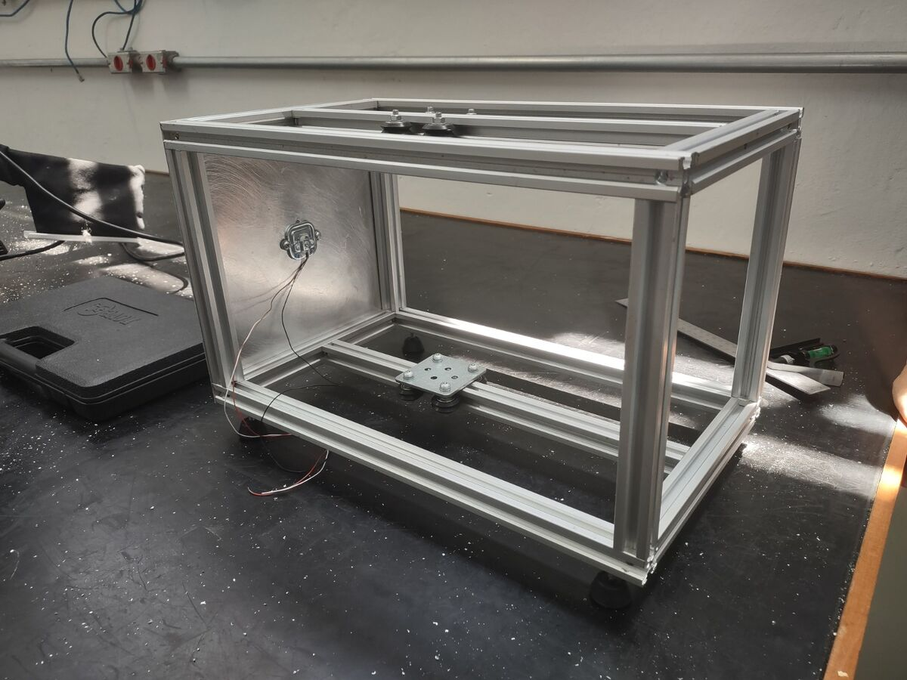
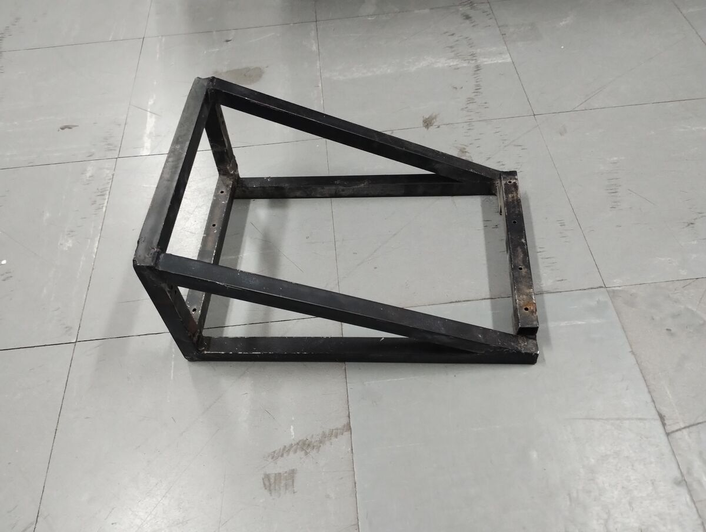
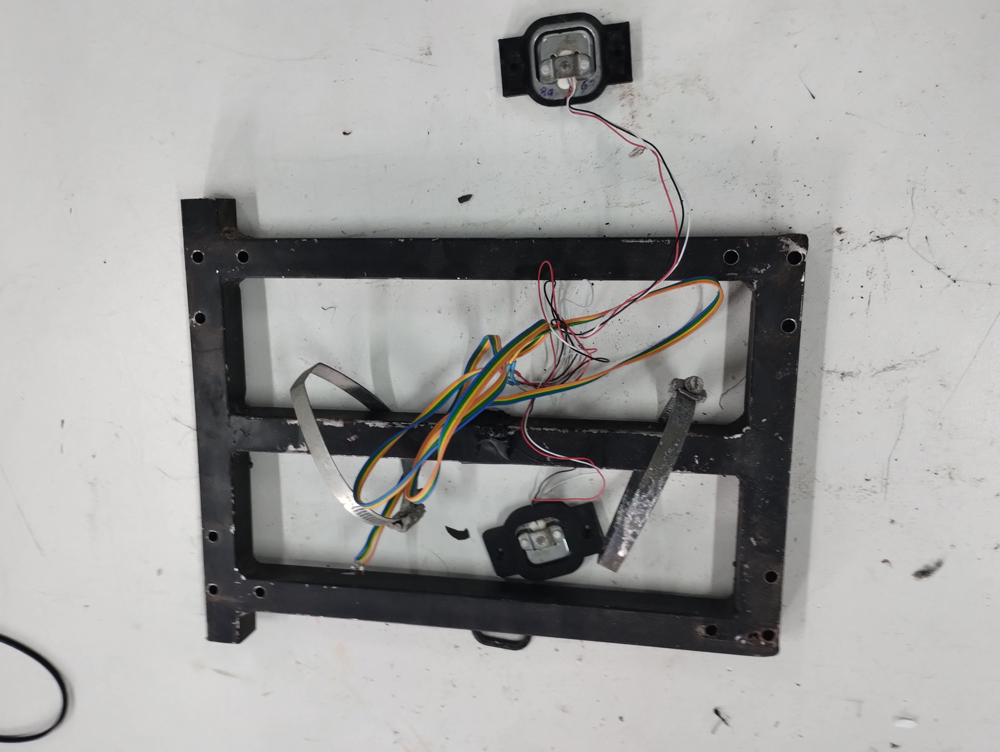
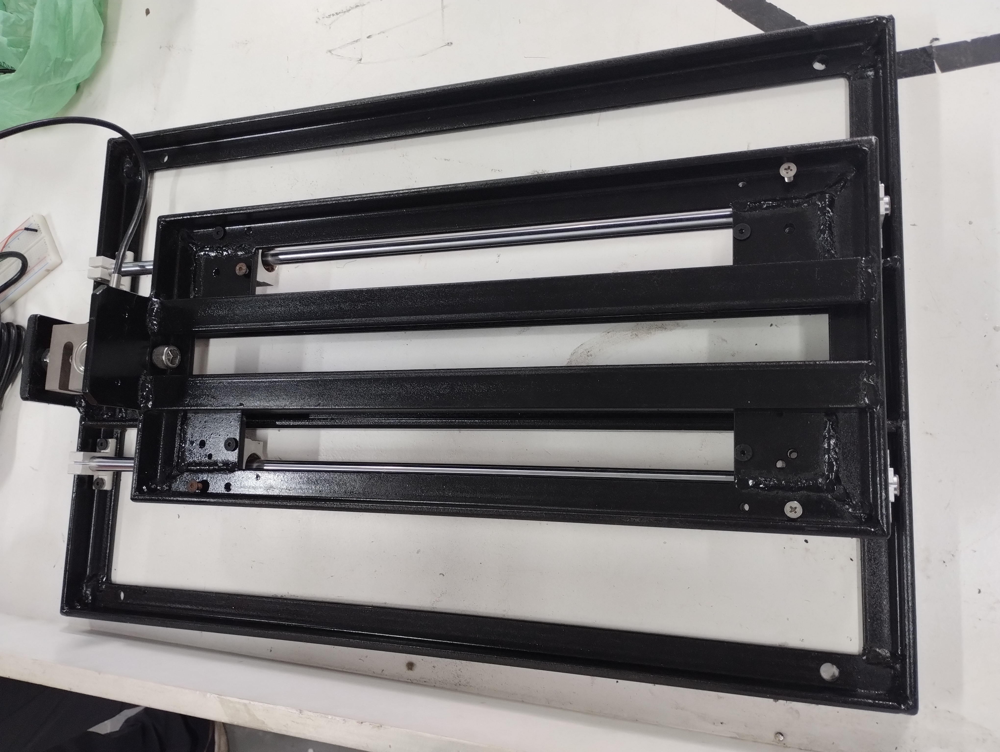
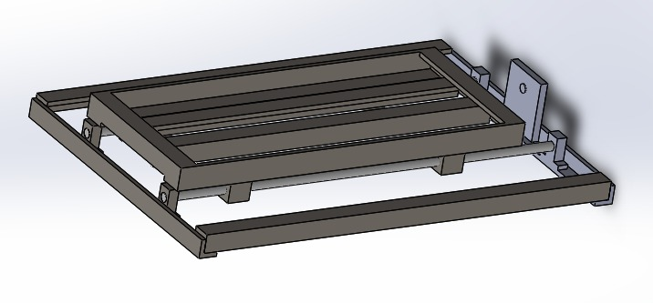

# 📦 Evolução da Caixa de Teste Estático

## Visão Geral

Acompanha a evolução da estrutura física do sistema de teste estático ao longo de 3 versões, desde protótipo em alumínio até estrutura industrial em aço com guias lineares.

---

## V1 — Perfil V-slot 20×20mm (Alumínio)

### Estrutura

- Perfil de alumínio extrudado V-slot 20×20mm
- Formato: caixão retangular aberto
- Trilho central longitudinal
- Disco branco (prato de balança / plataforma de apoio)
- PCB verde conectada internamente
- Versão com rolamentos: dois rolamentos/flanges na travessa superior, placa de fixação metálica, eixo passante/suporte de motor

### Sensores

- 1 célula de carga fixada na base

### Fixação

- Parafusos na base (difícil de fixar no chão)

### Problemas

- Custo alto do perfil V-slot
- Robustez insuficiente
- Dificuldade de fixação no chão

### Fotos

---

## V2 — Metalon 20×20mm (Aço)

### Estrutura

- Tubo quadrado de aço (metalon) 20×20mm
- Geometria trapezoidal/triangulada (suporte para carga assimétrica)
- Pintada de preto
- Estrutura soldada (diferente da v1 modular com parafusos)

### Sensores

- 2 células de carga em encapsulamento preto
- Configuração Wheatstone (medição de empuxo + momento)

### Fixação

- Parafusos na base

### Problemas

- Soldagem difícil — estrutura ficou torta/desalinhada
- Abandonada devido à dificuldade de fabricação

### Fotos

---

## V3 — Cantoneira 1″ × 1/4″ (Aço)

> Para especificações completas da V3, ver [V3_DETALHES.md](./V3_DETALHES.md).

### Estrutura

- Cantoneira de aço 1 polegada × 1/4 de polegada
- Mesa deslizante com trilhos lineares:
  - Dois eixos lineares cromados
  - Carrinhos lineares (rolamentos lineares)
  - Estrutura central deslizante
- Suporte de motor com fixação por flange
- Pintada de preto

### Sensores

- 1 célula de carga fixada na base

### Fixação

- Parafusos na base (melhorado em relação à v1)

### Render CAD

Mostra a base + estrutura deslizante completa. Design influenciado pelas iterações anteriores.

### Fotos

---

## Comparativo

| Aspecto          | V1                          | V2                         | V3                                |
| ---------------- | --------------------------- | -------------------------- | --------------------------------- |
| Material         | Alumínio V-slot 20×20mm     | Aço metalon 20×20mm        | Aço cantoneira 1″ × 1/4″         |
| Geometria        | Retangular                  | Trapezoidal                | Retangular + mesa deslizante      |
| Montagem         | Modular (parafusos T-nut)   | Soldada                    | Soldada + trilhos lineares        |
| Células de carga | 1                           | 2 (Wheatstone)             | 1                                 |
| Fixação no chão  | Difícil                     | Melhor                     | Melhorada                         |
| Robustez         | Baixa                       | Média                      | Alta                              |
| Custo relativo   | Alto (perfil importado)     | Baixo                      | Médio                             |
| Status           | Abandonada                  | Abandonada (solda torta)   | **Atual**                         |

---

## Conclusões

- **V1**: prototipagem rápida, explorou conceitos de guia linear e montagem modular, mas cara e frágil
- **V2**: tentativa de industrialização com geometria trapezoidal para cargas assimétricas, mas soldagem inadequada resultou em desalinhamento
- **V3**: evolução natural — combina robustez da cantoneira de aço com precisão de trilhos lineares e carrinhos, voltando à configuração de célula de carga única
