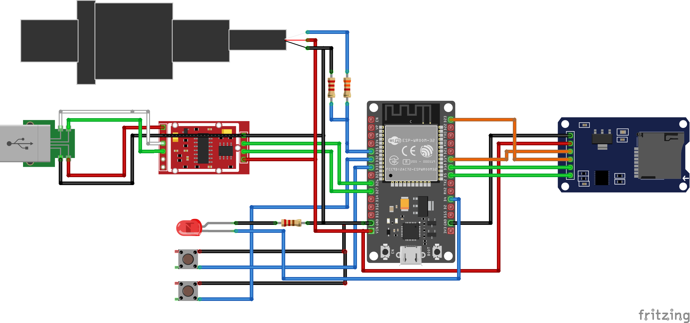

# 🔌 Hardware - Sistema de Teste Estático

## 📋 Visão Geral do Sistema

Sistema embarcado baseado em ESP32 para aquisição de empuxo e pressão em testes estáticos de motores de foguetes, com gravação local de dados no cartão SD e telemetria via Serial/Bluetooth.

Controles físicos do esquemático atual:

- `GPIO32`: botão para TARE (zerar a célula de carga)
- `GPIO33`: botão para iniciar um novo arquivo de log no SD
- `GPIO4`: LED de indicador de funcionamento (aceso durante gravação no SD)

## 🧩 Lista de Componentes (BOM)

| Componente                | Quantidade | Especificações                                |
| ------------------------- | ---------- | --------------------------------------------- |
| ESP32 DevKit V1           | 1          | 30/38 pinos, WiFi/BT                          |
| Célula de carga           | 1          | Compatível com HX711                          |
| Módulo HX711              | 1          | ADC 24 bits para célula de carga              |
| Sensor de pressão         | 1          | 0-10 MPa, saída analógica 0.5-4.5V            |
| Módulo microSD            | 1          | Interface SPI                                 |
| LED                       | 1          | 5mm, vermelho                                 |
| Botão tátil (TARE)        | 1          | 6x6mm                                         |
| Botão tátil (novo arquivo)| 1          | 6x6mm                                         |
| Resistores do divisor     | 2          | 2.2kΩ e 3.3kΩ                                 |
| Resistor do LED           | 1          | 220Ω (valor típico)                           |
| Fonte de alimentação      | 1          | 5V 2A (mínimo recomendado)                    |

## 🔄 Mapeamento de Conexões

| ESP32 | Função no sistema |
| ----- | ----------------- |
| `GPIO26` | HX711 `DT` |
| `GPIO27` | HX711 `SCK` |
| `GPIO35` | Entrada do sensor de pressão (via divisor resistivo) |
| `GPIO5`  | microSD `CS` |
| `GPIO23` | microSD `MOSI` |
| `GPIO19` | microSD `MISO` |
| `GPIO18` | microSD `SCK` |
| `GPIO4`  | LED de gravação |
| `GPIO32` | Botão TARE |
| `GPIO33` | Botão novo arquivo |
| `VIN`    | Alimentação 5V dos módulos |
| `GND`    | Terra comum |

Observações de ligação:

- Botões: um terminal no GPIO correspondente e o outro no `GND`.
- LED: ligado ao `GPIO4` com resistor em série.
- Sensor de pressão: saída analógica passa por divisor resistivo antes de chegar ao `GPIO35`.

## 🛠️ Procedimento de Montagem

1. Preparação dos componentes

- Verifique todos os itens da BOM
- Teste ESP32 e cartão SD separadamente antes da montagem final

2. Sequência recomendada

- Conecte alimentação (`VIN` e `GND`)
- Conecte HX711 e célula de carga
- Conecte módulo microSD (SPI)
- Conecte sensor de pressão com divisor resistivo
- Conecte LED de status
- Conecte os dois botões (`GPIO32` e `GPIO33`)

3. Divisor resistivo para o sensor de pressão

```
Vsensor (0.5-4.5V) --- R1 (2.2kΩ) --- GPIO35
                         |
                        R2 (3.3kΩ)
                         |
                        GND
```

Cálculo do divisor:

```
Vout = Vsensor * (R2 / (R1 + R2))

# Exemplo
Vout_max = 4.5V * (3300 / (2200 + 3300)) = 2.7V
```

## 📷 Foto de Referência

Montagem completa:



## ⚠️ Considerações de Projeto

- [x] Divisor resistivo no sensor de pressão
- [x] Terra comum entre todos os módulos
- [x] Botões dedicados para TARE e novo arquivo
- [x] LED dedicado para indicação de gravação no SD
- [ ] Isolamento contra vibrações
- [ ] Proteção contra poeira e umidade

## 🧪 Testes de Hardware

### Testes pré-montagem

- Continuidade dos cabos
- Tensão de alimentação estável
- Comunicação SPI com microSD
- Leitura de sensores individuais

### Testes pós-montagem

- Botão `GPIO32` realiza TARE
- Botão `GPIO33` inicia novo arquivo
- LED acende durante gravação no SD
- Leituras de empuxo e pressão estáveis
