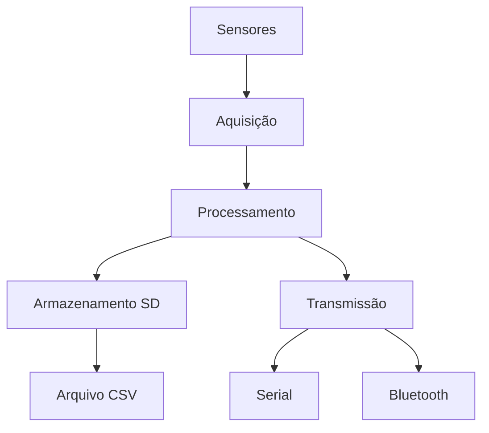

# 📚 Documentação Técnica - Sistema de Teste Estático

Esta documentação reúne o necessário para montagem, calibração, operação e troubleshooting do sistema baseado em ESP32.

## 🗂️ Estrutura da Documentação

### 1. Guia de Instalação

- Requisitos de hardware e software
- Configuração do ambiente
- Primeira execução

### 2. [Hardware](./HARDWARE.md)

- Lista de componentes (BOM)
- Mapeamento de pinos e conexões
- Função dos botões e do LED

### 3. [Firmware](./FIRMWARE.md)

- Arquitetura e fluxo de aquisição
- Calibração da célula de carga
- Sistema de arquivos e armazenamento

### 4. [API e Protocolos](./API.md)

- Comandos seriais
- Controles físicos
- Exemplos de interação

### 5. [Troubleshooting](./TROUBLESHOOTING.md)

- Problemas comuns e diagnóstico rápido
- Procedimentos de correção

### 6. [Evolução da Caixa](./EVOLUÇÃO_CAIXA.md)

- Histórico das 3 versões da estrutura física
- Comparativo de materiais e design

## 📊 Diagramas Técnicos

Arquitetura do sistema:

```
[Sensores] -> [ESP32] -> [Armazenamento] -> [Comunicação]
    |            |             |               |
 Célula/HX711  Process.      microSD        Serial/BT
 Pressão       Dados         Arquivo CSV    Monitoramento
```

Fluxo de dados:



## 🛠️ Recursos Técnicos

### Especificações do Sistema

- Microcontrolador: ESP32
- Sensores: célula de carga (HX711) e sensor de pressão analógico
- Armazenamento: cartão SD (SPI), com fallback para LittleFS
- Comunicação: Serial USB e Bluetooth
- Controles físicos:
  - Botão `GPIO32`: TARE
  - Botão `GPIO33`: iniciar novo arquivo
  - LED `GPIO4`: aceso durante gravação no SD

### Formatos de Dados

- Logs: CSV (`Tempo,Empuxo,Pressao`)
- Configuração: `Preferences` (fator de calibração)
- Comunicação: comandos por texto

## 🤝 Contribuindo para a Documentação

1. Reporte inconsistências encontradas
2. Proponha melhorias de texto e organização
3. Abra PR com correções objetivas
