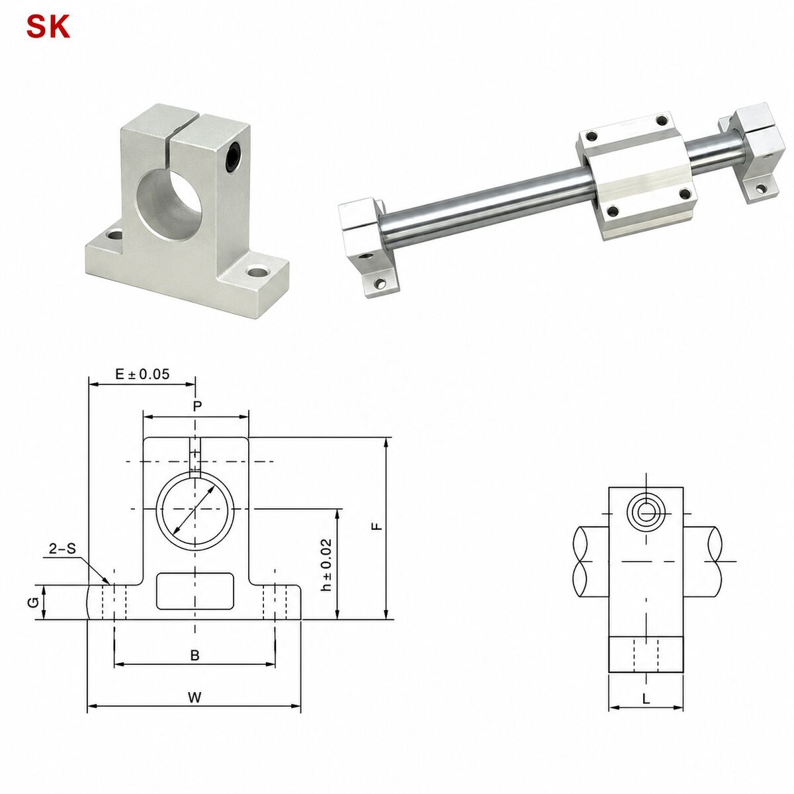
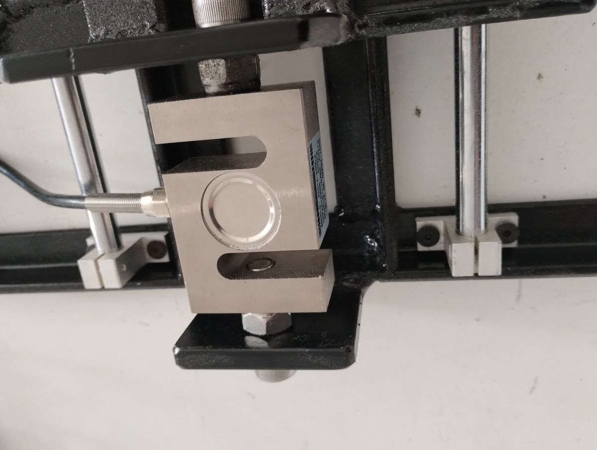
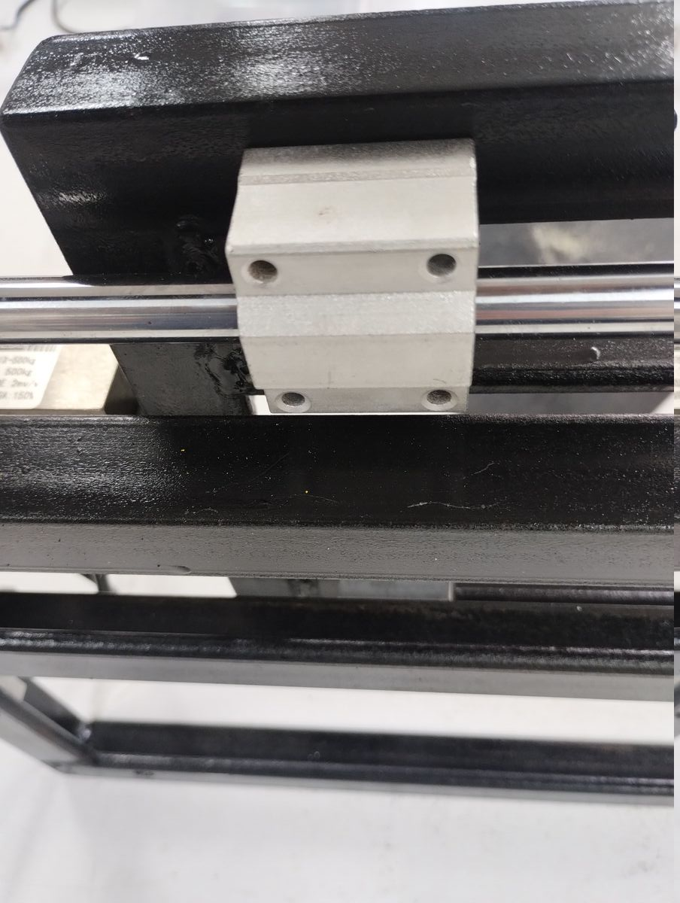
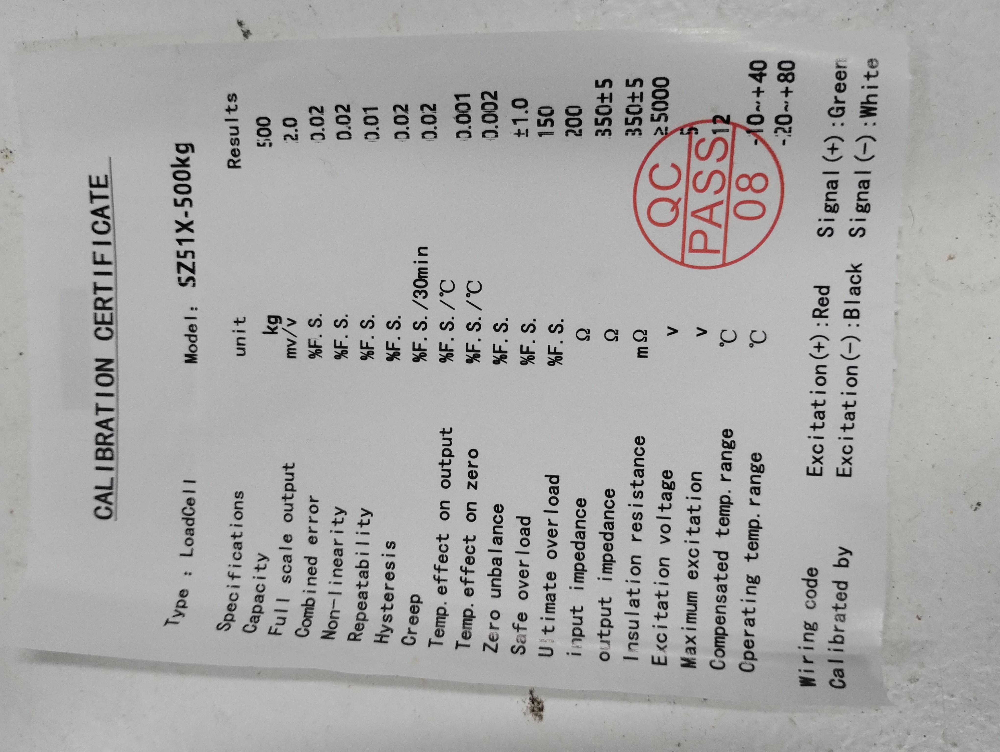

# 🔧 V3 — Detalhes Técnicos da Bancada

## Visão Geral

Especificações completas da versão 3 da bancada de teste estático da Serra Rocketry. Esta versão utiliza cantoneira de aço com sistema de guia linear para medição precisa de empuxo em motores experimentais de médio porte.

---

## Especificações Estruturais

| Componente | Especificação |
|------------|---------------|
| Material da estrutura | Cantoneira de aço 1″ × 1/4″ |
| Pintura | Preto |
| Geometria | Retangular + mesa deslizante |

### Modelo CAD

[Baixar modelo STEP](../hardware/teste_estatico/step/caixa_v3.step)

---

## Sistema de Guia Linear

| Componente | Especificação |
|------------|---------------|
| Mancal (suporte de eixo) | SK12 |
| Pillow Block (rolamento linear) | SC12UU |
| Eixo linear | ⌀12mm, comprimento 600mm |
| Tipo | Auto-alinhante (self-aligning) |
| Material do mancal | Alumínio fundido |
| Quantidade de eixos | 2 (paralelos, sem torção) |
| Fixação do Pillow Block | 16× parafusos M5×12mm |

<table>
  <tr>
    <td></td>
    <td></td>
  </tr>
</table>

<table>
  <tr>
    <td></td>
    <td></td>
  </tr>
</table>

O sistema de guia linear permite que o carro da bancada mova-se axialmente, transmitindo o empuxo do motor para a célula de carga sem cargas laterais parasitas. Os dois eixos paralelos garantem ausência de torção.

---

## Célula de carga

### Modelo

**SZ51X-500kg** — Fabricante: PESO

- Tipo: Viga em S (shear beam)
- Material: Aço inox
- Configuração: Cisalhamento entre dois suportes metálicos

### Especificações (Certificado de Calibração)

| Parâmetro | Valor |
|-----------|-------|
| Capacidade | 500 kgf (~4,9 kN) |
| Sensibilidade (full scale output) | 2,0 mV/V |
| Erro combinado | 0,02% F.S. |
| Não-linearidade | 0,02% F.S. |
| Repetibilidade | 0,01% F.S. |
| Histerese | 0,02% F.S. |
| Creep (30 min) | 0,02% F.S. |
| Sobrecarga segura | ±1,0% F.S. |
| Sobrecarga última | 150% F.S. |
| Impedância de entrada | 200 Ω |
| Impedância de saída | 350±5 Ω |
| Tensão de excitação | 5V (recomendado) / 12V (máx) |
| Temperatura compensada | -10 ~ +40°C |
| Temperatura de operação | -20 ~ +80°C |
| Aprovação QC | Pass 08 |

### Fiação

| Cor | Função |
|-----|--------|
| Vermelho | E+ (Excitação +) |
| Preto | E− (Excitação −) |
| Verde | S+ (Sinal +) |
| Branco | S− (Sinal −) |

Célula de carga tipo viga em S em aço inox, montada em configuração de cisalhamento entre dois suportes metálicos da estrutura pintada de preto.

Certificado do fabricante com especificações completas da SZ51X-500kg.

---

## Resolução Estimada

Com o HX711 (24 bits) ou ADS1232 na aquisição:

- **Fundo de escala:** 4,9 kN (500 kgf)
- **Resolução estimada:** ~0,5 N
- **Cobertura:** Motores experimentais de médio porte (Dédalo, Thonyan)
